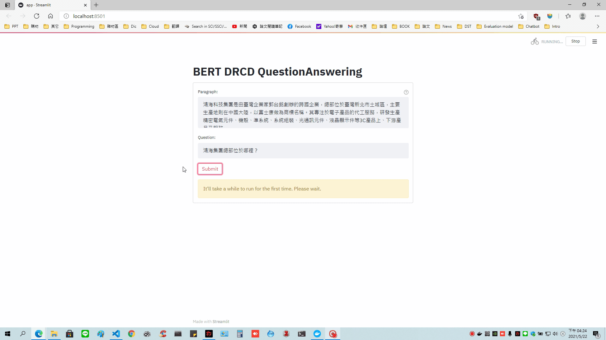

# 🤗 BERT-DRCD-QuestionAnswering

This project features `FastAPI` as the backend and `Streamlit` as the frontend. Our streamlit UI will send the post request to the backend and receive the response. The [QA model](https://huggingface.co/nyust-eb210/braslab-bert-drcd-384) is deployed using the FastAPI REST service and containerized using `Docker`. The streamlit UI is also hosted on its own Docker container.

We spin both the containers together using `Docker Compose`.

## Streamlit UI

Navigate to [http://127.0.0.1:8501/](http://127.0.0.1:8501/) after spinning up the application from local machine or docker host.



## Interactive API docs

Navigate to [http://127.0.0.1:8000/docs](http://127.0.0.1:8000/docs) after spinning up the application from local machine or docker host.

You will see the automatic interactive API documentation (provided by [Swagger UI](https://github.com/swagger-api/swagger-ui)):


## Quick start - Using Docker Compose

### Running Docker applications

Spin up our containers in detached mode.

```bash
docker-compose up -d
docker ps             # To check the running containers
docker-compose down   # To shutdown the running containers
```

## Quick start - Local Machine

### Install the dependencies

*Create your virtual environment beforehand as a best practice.*

* Go to the project directory
* Install the requirements for both FastAPI and Streamlit

```bash
pip install -r requirements.txt
```

### Start the FastAPI server

* Go to the "fastapi" directory
* Run the following command

```bash
uvicorn app.main:app --reload
```

### Start the Streamlit server

* Go to the "streamlit" directory
* Run the following command
* You should change the backend_pred_url in app.py to "http://127.0.0.1:8000/predict/" if running locally

```bash
streamlit run app.py
```

