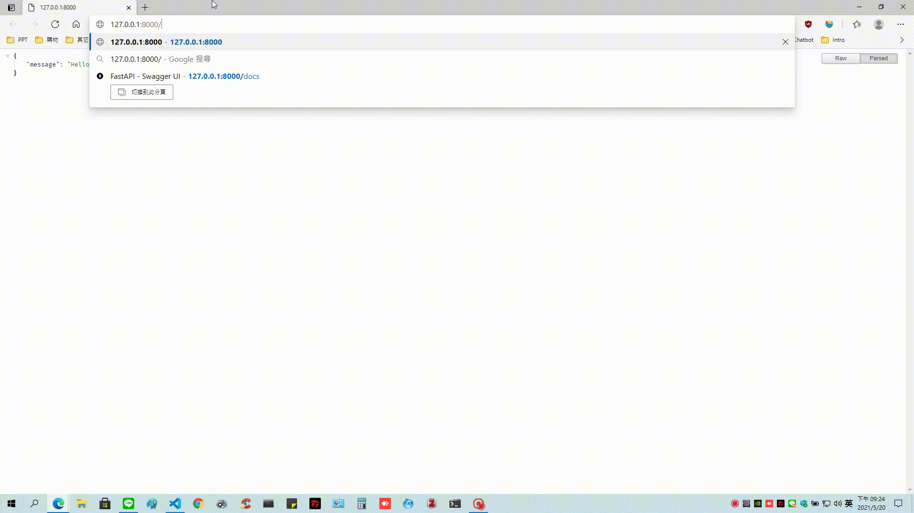

# 🤗 BERT-DRCD-QuestionAnswering

This project showcases the use of `FastAPI` as the backend. The [QA model](https://huggingface.co/nyust-eb210/braslab-bert-drcd-384) is deployed using the FastAPI REST service and containerized using `Docker`.

## Interactive API docs

Navigate to [http://127.0.0.1/docs](http://127.0.0.1/docs) after spinning up the application from local machine or docker host.

You will see the automatic interactive API documentation (provided by [Swagger UI](https://github.com/swagger-api/swagger-ui)):



## Quick start - Using Docker

### Build your Image

* Go to the project directory
* Build your FastAPI image

```bash
docker build -t $your-image-name .
```

### Start the Docker container

* Run a container based on your image

```bash
docker run -d --name $your-container-name -p 80:80 $your-image-name
```

## Quick start - Local Machine

### Install the dependencies

*Create your virtual environment beforehand as a best practice.*

* Go to the project directory
* Install the requirements

```bash
pip install -r requirements.txt
```

### Start the FastAPI server

* Go to the "app" directory
* Run the following command

```bash
uvicorn main:app --reload
```
